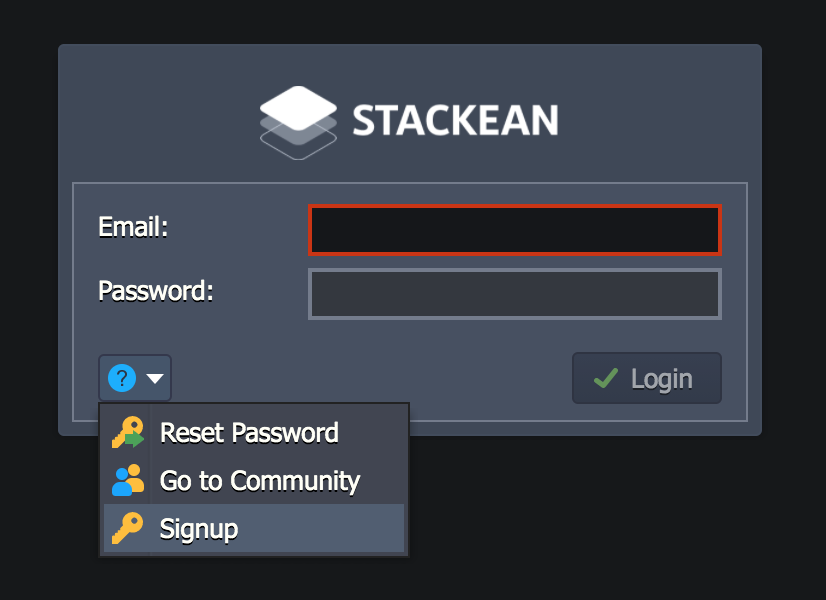
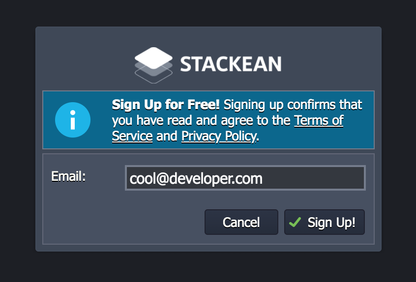

# Getting Started

### Sign Up: How to Create an Account 

In order to start working with Stackean, you need the appropriate account. So, if you don’t have one yet, register a new one via dashboard.

Click on question mark button on left bottom corner. Then follow Signup link. This will redirect you to signup form.

Enter your email address and click on sign up button.

